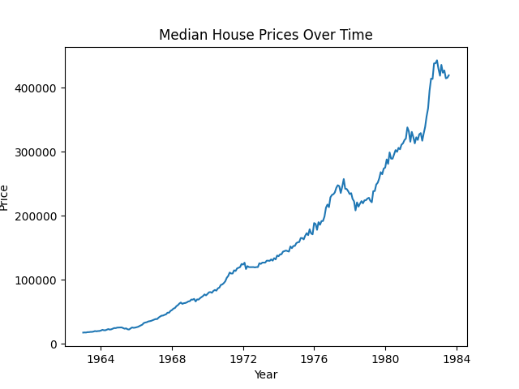
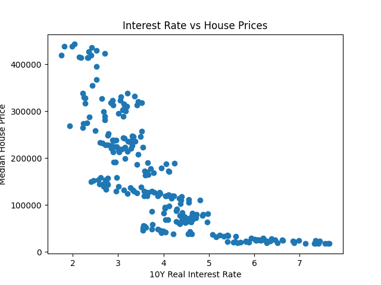

# U.S. Housing & Land Price Forecasting  
**Indiana University Indianapolis — Undergraduate Econometric Research**

---

## 🧩 Project Overview

This project studies how macroeconomic conditions drive U.S. housing prices using
a full applied‑econometrics workflow combining **Stata diagnostics** and **Python ARIMA forecasting**.

---

## 🎯 Research Questions

- How do real interest rates influence housing prices?
- Is housing price growth persistent over time?
- Which ARIMA specification best captures housing market dynamics?
- How reliable are housing price forecasts during periods of macro volatility?

---

## 🛠 Tools Used

Python (pandas, statsmodels), Stata, matplotlib, GitHub

---

## 📁 Repository Structure

data/ – cleaned & raw datasets  
stata/ – Stata .do econometric scripts  
notebooks/ – Python forecasting workflow  
visuals/ – charts & figures  
paper/ – research paper  
presentation/ – slides  

---

## 🧹 Data Cleaning

The raw dataset contained redundant time columns and missing values.
Cleaning steps included:

- Removing invalid columns  
- Parsing time variables  
- Selecting core macro drivers:
  - Median house price
  - Real disposable income
  - Unemployment rate
  - 10‑year real interest rate
- Exporting final dataset to `data/housing_clean.csv`

---

## 📊 Exploratory Analysis

### Median Housing Prices Over Time

### Real Interest Rates vs Housing Prices

---

## 🔮 Forecasting Methodology

An **ARIMA(1,1,1)** model was estimated to generate a 24‑month forecast.

---

## 📉 Forecast Results

---

## 📈 Stata Econometrics

All regression diagnostics, stationarity testing, and AR models are stored in:

stata/housing_analysis.do

---

## 📫 Contact

**Jordan Small**  
jordsmal@iu.edu  
https://linkedin.com/in/jordan-small-6b142425a
