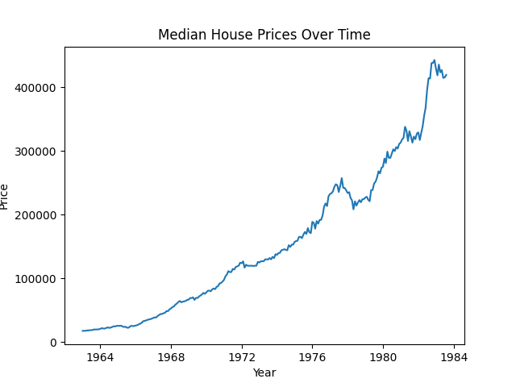
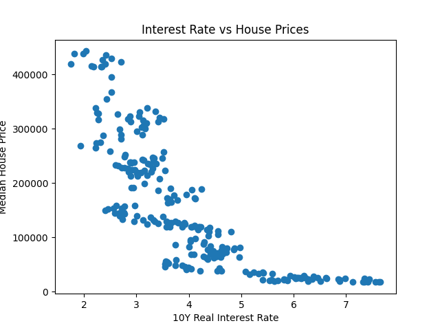
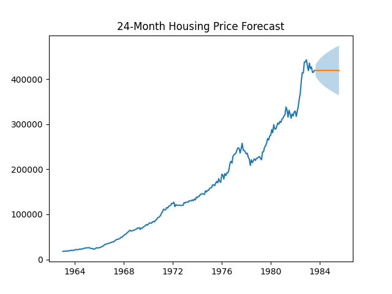

# U.S. Housing & Land Price Forecasting  
**Undergraduate Econometric Research — Indiana University Indianapolis**

---

## 1. Motivation & Research Question

Traditional macroeconomic indicators such as GDP, unemployment, inflation, and interest rates are commonly used to assess the health of the U.S. economy. However, economic theory and empirical research emphasize that **land values play a central role in business cycles, speculative booms, and financial instability**.

Because direct land price data are limited, this project uses **housing prices as a proxy for land values**. The land component of housing prices captures speculative behavior and cyclical dynamics that often precede broader macroeconomic downturns. Prior research (e.g., Deaton; Hirano & Stiglitz) highlights the destabilizing role of land speculation in economic fluctuations.

**Research Question**  
> Can housing prices (as a proxy for land values) serve as a benchmark and predictive indicator for U.S. macroeconomic conditions?

To answer this, the project combines econometric modeling, time-series diagnostics, and multiple forecasting methodologies.

---

## 2. Repository Structure

- **data/**: cleaned macroeconomic dataset (1982–2024)  
- **visuals/**: all figures embedded below  
- **code/**: fully reproducible Stata analysis  
- **slides/**: presentation with theory, diagnostics, and results  
- **paper/**: full econometric research paper  

---

## 3. Data & Preparation

Data were compiled from FRED covering **1982–2024**. Variables were inflation-adjusted where appropriate.

Preparation steps:
- Parsed dates into time-series format  
- Removed redundant and unnamed columns  
- Selected core variables:
  - Median house price (proxy for land price)
  - Real GDP
  - Real disposable income
  - Unemployment rate
  - Inflation
  - 10-year real interest rate
- Dropped missing observations and sorted chronologically  

Final dataset:  
`data/housing_clean.csv`

---

## 4. Exploratory Data Analysis

### Median House Prices Over Time

Housing prices display a strong long-run upward trend with pronounced cyclical behavior, consistent with speculative dynamics and macroeconomic expansions and contractions.

---

### Interest Rates vs. Housing Prices

A clear **negative relationship** exists between real interest rates and housing prices. Higher borrowing costs reduce housing demand and asset valuations, aligning with macroeconomic theory.

---

## 5. Econometric Model Specification

The baseline econometric model treats **housing (land) prices as the endogenous variable**, explained by macroeconomic fundamentals:

\[
\text{Land Price}_t =
\beta_0 +
\beta_1 \text{GDP}_t +
\beta_2 \text{Interest Rate}_t +
\beta_3 \text{Income}_t +
\beta_4 \text{Inflation}_t +
\beta_5 \text{Unemployment}_t +
\varepsilon_t
\]

- Endogenous variable: housing / land price  
- Exogenous variables: GDP, interest rate, income, inflation, unemployment  
- ε: unobserved economic shocks  

An initial OLS regression produced a high R² (~0.95), but stationarity tests indicated this was driven by shared trends rather than causal relationships.

---

## 6. Time-Series Diagnostics

### Partial Autocorrelation Function (PACF)

A strong spike at lag 1 indicates significant dependence on the previous period, supporting an autoregressive structure.

---

### Autocorrelation Function (ACF)

Gradual decay across lags suggests strong persistence and motivates ARIMA-type modeling.

---

## 7. Residual Diagnostics

Residuals appear approximately normally distributed with no visible heteroskedasticity, supporting model assumptions.

---

## 8. Forecasting Methodology

Multiple forecasting approaches were evaluated:

- Naive and seasonal naive benchmarks  
- Double exponential smoothing (centered moving averages)  
- Holt-Winters additive models (level and log-transformed)  
- ARIMA-based forecasting  

Naive models provide baselines, while smoothing and ARIMA methods better capture trend persistence and uncertainty.

---

## 9. Forecast Results

### ARIMA 24-Month Forecast

---

### 95% Confidence Interval Forecast

---

### Double Exponential Smoothing

---

### Holt-Winters Additive

Log-transformed Holt-Winters models yield smoother and more interpretable long-run trends.

---

## 10. Code & Reproducibility

All analysis is fully reproducible in Stata:

`code/stata/forecasting_models.do`

Includes:
- Naive and seasonal naive forecasts  
- Double exponential smoothing  
- Holt-Winters additive models  
- ARIMA(1,1,1) estimation  
- Residual diagnostics  

---

## 11. Key Findings & Implications

- Housing prices capture speculative dynamics not fully reflected in traditional indicators  
- Real GDP and interest rates are statistically significant predictors  
- Housing (land) prices can act as **early warning signals** for macroeconomic downturns  
- Monitoring housing prices may improve forecasting and policy design  

---

## 12. Authors

**Jordan Small**  
Alan Zaragoza  
Eric Reingardt  

Indiana University Indianapolis

