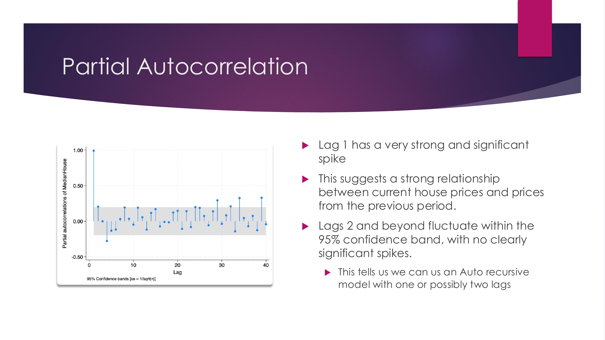
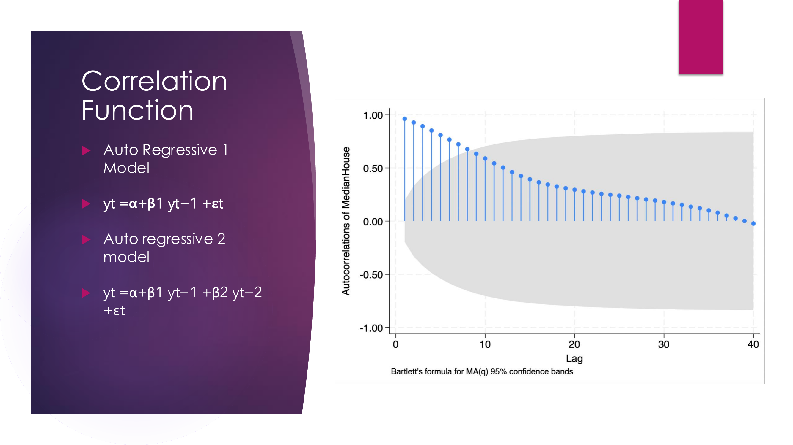
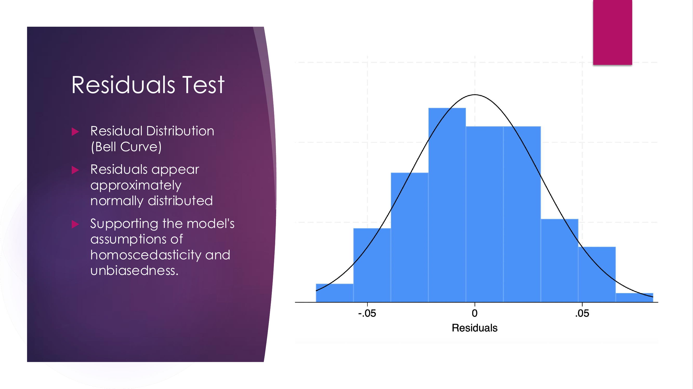
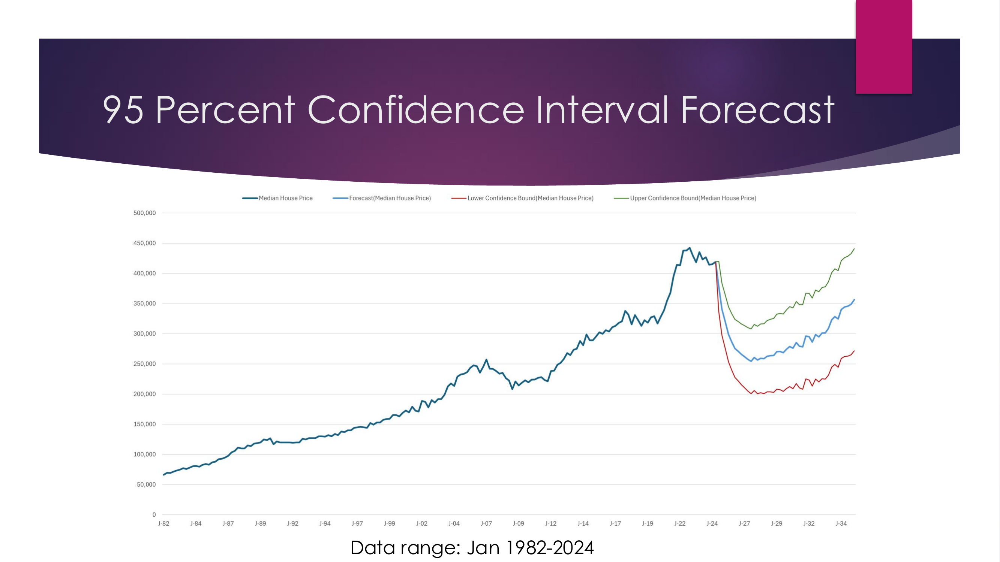
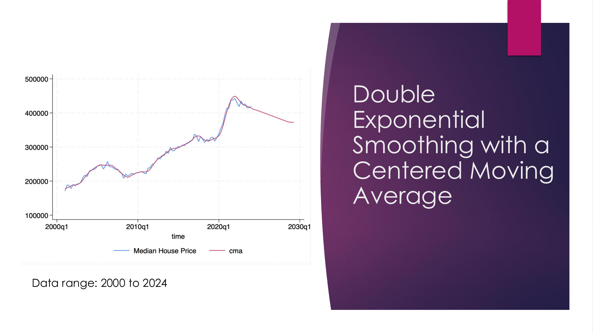
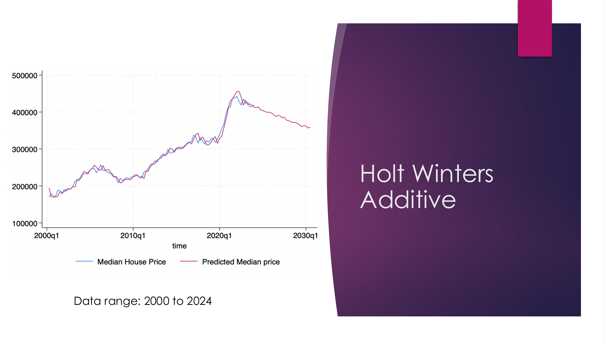

# U.S. Housing & Land Price Forecasting
**Undergraduate Econometric Research — Indiana University Indianapolis**

## Project Overview
This project studies U.S. housing and land prices as a benchmark for macroeconomic
conditions using econometric modeling and time-series forecasting.

## Econometric Model
Land Price = β₀ + β₁GDP + β₂InterestRate + β₃Income + β₄Inflation + β₅Unemployment + ε

## Correlation Diagnostics
### Partial Autocorrelation

### Autocorrelation Function

## Residual Diagnostics

## Forecast Results
### 95% Confidence Interval Forecast

### Double Exponential Smoothing

### Holt-Winters Additive

## Code
Stata code available in `code/stata/forecasting_models.do`.
